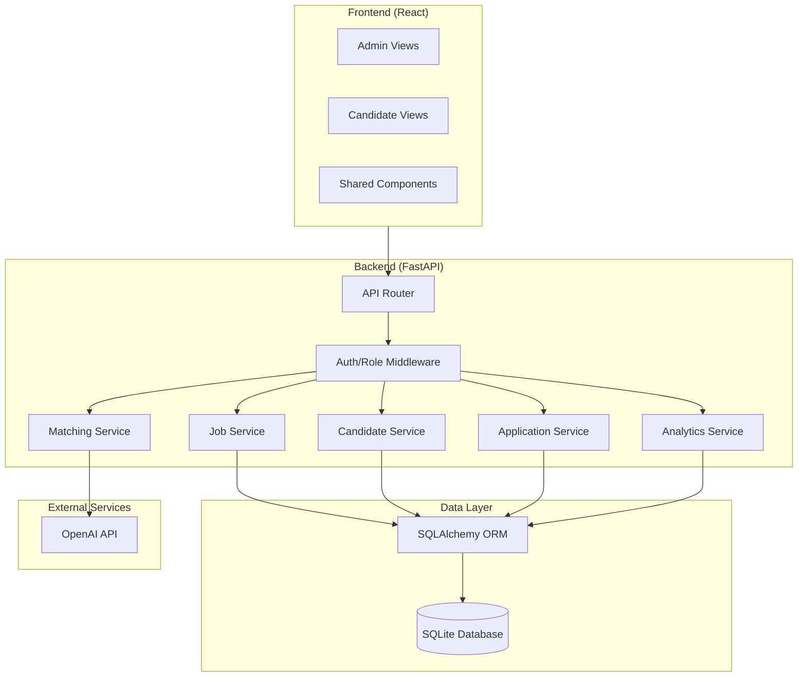

# Design Document: AI Job Board

## Overview

The AI Job Board is a full-stack web application that connects Company Admins with Candidates through intelligent job matching. The system provides traditional CRUD-based job management alongside an AI-powered matching engine that allows candidates to describe their ideal role in natural language and receive ranked, explained job recommendations.

The architecture follows a clean client-server separation: a Python FastAPI backend exposing a RESTful JSON API, a React frontend providing role-specific interfaces, and an AI matching layer that integrates with OpenAI's API for semantic understanding of candidate queries against job listings.

### Key Design Decisions

1. **FastAPI over Flask**: FastAPI provides automatic OpenAPI docs, built-in request validation via Pydantic, async support for AI API calls, and better performance. It aligns with the project brief's preference.
2. **SQLite for persistence**: Simple file-based database requiring zero configuration. SQLAlchemy ORM provides an upgrade path to PostgreSQL later.
3. **OpenAI API for matching**: Leverages GPT models for natural language understanding and semantic matching rather than building custom ML pipelines.
4. **Role-based routing in React**: Separate route trees for Admin and Candidate views, with shared UI components.

## Architecture



### Folder Structure

```
Project_aami/
├── backend/
│   ├── app/
│   │   ├── __init__.py
│   │   ├── main.py              # FastAPI app entry point
│   │   ├── config.py            # Settings and environment config
│   │   ├── database.py          # SQLAlchemy engine and session
│   │   ├── models/              # SQLAlchemy ORM models
│   │   │   ├── __init__.py
│   │   │   ├── job_listing.py
│   │   │   ├── candidate_profile.py
│   │   │   └── application.py
│   │   ├── schemas/             # Pydantic request/response schemas
│   │   │   ├── __init__.py
│   │   │   ├── job.py
│   │   │   ├── candidate.py
│   │   │   ├── application.py
│   │   │   └── matching.py
│   │   ├── routers/             # API route handlers
│   │   │   ├── __init__.py
│   │   │   ├── jobs.py
│   │   │   ├── candidates.py
│   │   │   ├── applications.py
│   │   │   ├── matching.py
│   │   │   └── analytics.py
│   │   ├── services/            # Business logic layer
│   │   │   ├── __init__.py
│   │   │   ├── job_service.py
│   │   │   ├── candidate_service.py
│   │   │   ├── application_service.py
│   │   │   ├── matching_service.py
│   │   │   └── analytics_service.py
│   │   └── utils/               # Shared utilities
│   │       ├── __init__.py
│   │       ├── pagination.py
│   │       └── exceptions.py
│   ├── requirements.txt
│   └── tests/
│       ├── __init__.py
│       ├── test_jobs.py
│       ├── test_candidates.py
│       ├── test_applications.py
│       ├── test_matching.py
│       └── conftest.py
├── frontend/
│   ├── public/
│   ├── src/
│   │   ├── components/          # Shared UI components
│   │   │   ├── LoadingSpinner.jsx
│   │   │   ├── ErrorNotification.jsx
│   │   │   ├── Pagination.jsx
│   │   │   └── FormField.jsx
│   │   ├── pages/
│   │   │   ├── admin/           # Admin-specific pages
│   │   │   │   ├── Dashboard.jsx
│   │   │   │   ├── JobManager.jsx
│   │   │   │   ├── JobForm.jsx
│   │   │   │   └── ApplicationReview.jsx
│   │   │   └── candidate/      # Candidate-specific pages
│   │   │       ├── Profile.jsx
│   │   │       ├── JobSearch.jsx
│   │   │       ├── AIMatching.jsx
│   │   │       └── MyApplications.jsx
│   │   ├── services/            # API client functions
│   │   │   └── api.js
│   │   ├── hooks/               # Custom React hooks
│   │   │   └── useApi.js
│   │   ├── App.jsx
│   │   └── main.jsx
│   ├── package.json
│   └── vite.config.js
└── README.md
```

## Components and Interfaces

### Backend Services

#### JobService
Handles all job listing CRUD operations with ownership validation.

```python
class JobService:
    def create_job(admin_id: int, data: JobCreateSchema) -> JobListing
    def update_job(admin_id: int, job_id: int, data: JobUpdateSchema) -> JobListing
    def update_status(admin_id: int, job_id: int, status: str) -> JobListing
    def get_job(job_id: int) -> JobListing
    def search_jobs(filters: JobFilterSchema, page: int, per_page: int) -> PaginatedResponse
```

#### CandidateService
Manages candidate profile lifecycle with one-profile-per-candidate constraint.

```python
class CandidateService:
    def create_profile(candidate_id: int, data: ProfileCreateSchema) -> CandidateProfile
    def update_profile(candidate_id: int, data: ProfileUpdateSchema) -> CandidateProfile
    def get_profile(candidate_id: int) -> CandidateProfile
```

#### ApplicationService
Handles job application submission and status management.

```python
class ApplicationService:
    def apply(candidate_id: int, job_id: int) -> Application
    def get_applications_for_job(admin_id: int, job_id: int, page: int) -> PaginatedResponse
    def update_status(admin_id: int, application_id: int, status: str) -> Application
    def get_candidate_applications(candidate_id: int, page: int) -> PaginatedResponse
```

#### MatchingService
Orchestrates the AI matching pipeline: query validation, embedding generation, scoring, and explanation.

```python
class MatchingService:
    def match(candidate_id: int, query: str) -> list[MatchResult]
    def _build_prompt(query: str, jobs: list[JobListing]) -> str
    def _parse_response(response: str) -> list[MatchResult]
```

#### AnalyticsService
Computes dashboard metrics scoped to the requesting admin's listings.

```python
class AnalyticsService:
    def get_dashboard(admin_id: int) -> DashboardMetrics
    def get_applications_per_job(admin_id: int) -> list[JobApplicationCount]
    def get_skills_distribution(admin_id: int) -> list[SkillCount]
    def get_status_breakdown(admin_id: int) -> dict[str, int]
```

### API Endpoints

| Method | Path | Description | Role |
|--------|------|-------------|------|
| POST | `/api/jobs` | Create job listing | Admin |
| GET | `/api/jobs` | Search/filter jobs | Any |
| GET | `/api/jobs/{id}` | Get job details | Any |
| PUT | `/api/jobs/{id}` | Update job listing | Admin (owner) |
| PATCH | `/api/jobs/{id}/status` | Change job status | Admin (owner) |
| POST | `/api/candidates/profile` | Create profile | Candidate |
| GET | `/api/candidates/profile` | Get own profile | Candidate |
| PUT | `/api/candidates/profile` | Update profile | Candidate |
| POST | `/api/matching` | AI job matching | Candidate |
| POST | `/api/jobs/{id}/apply` | Apply to job | Candidate |
| GET | `/api/jobs/{id}/applications` | List applications for job | Admin (owner) |
| PATCH | `/api/applications/{id}/status` | Update application status | Admin |
| GET | `/api/candidates/applications` | List own applications | Candidate |
| GET | `/api/admin/dashboard` | Get analytics | Admin |

### Frontend Components

#### Shared Components
- **LoadingSpinner**: Displayed during API calls, disables submit buttons
- **ErrorNotification**: Shows API errors, auto-dismisses after 5 seconds or manual dismiss
- **Pagination**: Page controls for list endpoints exceeding 20 items
- **FormField**: Input wrapper with inline validation message display

#### Admin Pages
- **Dashboard**: Charts showing applications per job, skill distribution, status breakdown
- **JobManager**: Table of owned jobs with status toggles, edit/create actions
- **JobForm**: Create/edit form with field validation (title ≤150 chars, description ≤5000 chars, etc.)
- **ApplicationReview**: List of applications per job with status update dropdowns

#### Candidate Pages
- **Profile**: Form for creating/editing profile (skills, education, projects, preferences)
- **JobSearch**: Filterable job list with skill, location, experience level filters
- **AIMatching**: Natural language input with ranked results showing scores and explanations
- **MyApplications**: List of submitted applications with current statuses

## Data Models

### Entity Relationship Diagram

```mermaid
erDiagram
    USER {
        int id PK
        string email UK
        string password_hash
        string role "admin | candidate"
        datetime created_at
    }

    JOB_LISTING {
        int id PK
        int admin_id FK
        string title "max 150 chars"
        text description "max 5000 chars"
        json required_skills "1-20 items"
        string experience_level "Entry|Mid|Senior|Lead"
        string location
        string status "open|closed"
        datetime created_at
        datetime updated_at
    }

    CANDIDATE_PROFILE {
        int id PK
        int candidate_id FK UK
        string name
        json skills "1-50 items, each ≤100 chars"
        json education "1-20 entries"
        json project_summaries "0-20 entries"
        string preferred_location "optional, ≤200 chars"
        string role_type "optional, ≤200 chars"
        string domain_interest "optional, ≤200 chars"
        datetime created_at
        datetime updated_at
    }

    APPLICATION {
        int id PK
        int candidate_id FK
        int job_id FK
        string status "Applied|Shortlisted|Rejected"
        datetime applied_at
        datetime updated_at
    }

    USER ||--o{ JOB_LISTING : "admin creates"
    USER ||--o| CANDIDATE_PROFILE : "candidate has"
    USER ||--o{ APPLICATION : "candidate submits"
    JOB_LISTING ||--o{ APPLICATION : "receives"
```

### SQLAlchemy Model Definitions

```python
class User(Base):
    __tablename__ = "users"
    id = Column(Integer, primary_key=True)
    email = Column(String, unique=True, nullable=False)
    password_hash = Column(String, nullable=False)
    role = Column(String, nullable=False)  # "admin" or "candidate"
    created_at = Column(DateTime, default=datetime.utcnow)

class JobListing(Base):
    __tablename__ = "job_listings"
    id = Column(Integer, primary_key=True)
    admin_id = Column(Integer, ForeignKey("users.id"), nullable=False)
    title = Column(String(150), nullable=False)
    description = Column(Text, nullable=False)
    required_skills = Column(JSON, nullable=False)  # list of strings
    experience_level = Column(String, nullable=False)
    location = Column(String, nullable=False)
    status = Column(String, default="open")
    created_at = Column(DateTime, default=datetime.utcnow)
    updated_at = Column(DateTime, onupdate=datetime.utcnow)

class CandidateProfile(Base):
    __tablename__ = "candidate_profiles"
    id = Column(Integer, primary_key=True)
    candidate_id = Column(Integer, ForeignKey("users.id"), unique=True, nullable=False)
    name = Column(String, nullable=False)
    skills = Column(JSON, nullable=False)         # list of strings
    education = Column(JSON, nullable=False)       # list of strings/objects
    project_summaries = Column(JSON, default=[])   # list of strings
    preferred_location = Column(String(200), nullable=True)
    role_type = Column(String(200), nullable=True)
    domain_interest = Column(String(200), nullable=True)
    created_at = Column(DateTime, default=datetime.utcnow)
    updated_at = Column(DateTime, onupdate=datetime.utcnow)

class Application(Base):
    __tablename__ = "applications"
    id = Column(Integer, primary_key=True)
    candidate_id = Column(Integer, ForeignKey("users.id"), nullable=False)
    job_id = Column(Integer, ForeignKey("job_listings.id"), nullable=False)
    status = Column(String, default="Applied")
    applied_at = Column(DateTime, default=datetime.utcnow)
    updated_at = Column(DateTime, onupdate=datetime.utcnow)
    __table_args__ = (UniqueConstraint("candidate_id", "job_id"),)
```

### AI Matching Engine Design

The matching engine uses OpenAI's chat completion API to perform semantic matching between a candidate's natural language query and the available open job listings.

**Approach: Prompt-Based Batch Scoring**

1. **Query Validation**: Validate input (non-empty, ≤1000 chars)
2. **Job Retrieval**: Fetch all open job listings from the database
3. **Prompt Construction**: Build a structured prompt containing the candidate query and summarized job data (title, skills, experience level, location)
4. **API Call**: Send to OpenAI GPT-4o-mini (cost-effective, fast) requesting JSON-formatted scores and explanations
5. **Response Parsing**: Parse the structured JSON response into MatchResult objects
6. **Ranking**: Sort by score descending, return top 20

**Prompt Template**:
```
You are a job matching assistant. Given a candidate's description of their ideal role 
and a list of job openings, score each job from 0-100 on how well it matches the 
candidate's preferences. Provide a brief explanation for each match.

Candidate's description: {query}

Available jobs:
{formatted_jobs}

Respond in JSON format:
[{"job_id": int, "score": int, "explanation": string}, ...]
```

**Fallback Strategy**: If the OpenAI API is unavailable, the service returns a 503 error with retry guidance. No local fallback model is used to keep the system simple.

**Cost Management**: Use GPT-4o-mini for scoring (low cost per token). Limit job summaries sent per request to reduce token usage. Cache results could be added later.


## Correctness Properties

*A property is a characteristic or behavior that should hold true across all valid executions of a system—essentially, a formal statement about what the system should do. Properties serve as the bridge between human-readable specifications and machine-verifiable correctness guarantees.*

### Property 1: Job listing validation rejects invalid input with field-level errors

*For any* job listing input that violates one or more constraints (empty title, title >150 chars, empty description, description >5000 chars, 0 or >20 skills, invalid experience level, empty location), the system SHALL reject the request and return an error message identifying each specific field that failed validation.

**Validates: Requirements 1.4, 1.5**

### Property 2: Job listing ownership authorization

*For any* Company Admin and any Job Listing they do not own, attempts to edit the listing or change its status SHALL be rejected with an authorization error.

**Validates: Requirements 1.7**

### Property 3: Profile partial update preserves unmodified fields

*For any* existing Candidate Profile and any partial update payload, fields not included in the update SHALL remain exactly unchanged after the update is persisted.

**Validates: Requirements 2.2**

### Property 4: Candidate profile validation rejects missing required fields

*For any* profile creation request missing a name or containing zero skills, the system SHALL reject the request and return a validation error identifying the missing required fields.

**Validates: Requirements 2.4**

### Property 5: Duplicate profile rejection

*For any* Candidate who already has a Candidate Profile, attempting to create a second profile SHALL be rejected with an error indicating a profile already exists.

**Validates: Requirements 2.5**

### Property 6: AI match results are bounded, scored, ordered, and explained

*For any* valid matching query (non-empty, ≤1000 chars), the matching engine response SHALL contain at most 20 results, each with a numeric score between 0 and 100 (inclusive), a non-empty explanation string, and the results SHALL be ordered by score descending.

**Validates: Requirements 3.1, 3.2**

### Property 7: AI matching only returns open listings

*For any* matching query, every Job Listing in the result set SHALL have a status of "open". No closed listing SHALL appear in match results.

**Validates: Requirements 3.3**

### Property 8: Whitespace-only queries are rejected

*For any* string composed entirely of whitespace characters (spaces, tabs, newlines), submitting it as a matching query SHALL return a validation error requesting a non-empty description.

**Validates: Requirements 3.4**

### Property 9: Applications to closed listings are rejected

*For any* Candidate with a profile and any Job Listing with status "closed", attempting to apply SHALL be rejected with an error indicating the listing is no longer accepting applications.

**Validates: Requirements 4.3**

### Property 10: Duplicate applications are rejected

*For any* Candidate who has already applied to a specific Job Listing, a second application to the same listing SHALL be rejected with an error.

**Validates: Requirements 4.4**

### Property 11: Applications require a candidate profile

*For any* Candidate without a Candidate Profile, attempting to apply to any Job Listing SHALL be rejected with an error indicating a profile must be created first.

**Validates: Requirements 4.5**

### Property 12: Application management respects job ownership

*For any* Company Admin and any Job Listing they do not own, attempts to view applications or update application statuses for that listing SHALL be rejected with an authorization error.

**Validates: Requirements 5.4**

### Property 13: Dashboard metrics accurately reflect underlying data

*For any* set of applications to a Company Admin's owned Job Listings, the dashboard SHALL report: (a) per-job application counts that equal the actual number of applications for each job, (b) per-skill counts that equal the actual number of applicants possessing each skill, and (c) per-status counts that sum to the total number of applications.

**Validates: Requirements 6.1, 6.2, 6.3**

### Property 14: Search filters use AND logic with case-insensitive matching

*For any* combination of search filters (skill, location, experience level), every Job Listing in the result set SHALL satisfy ALL specified filter criteria. Skill and location matching SHALL be case-insensitive (e.g., "python" matches "Python").

**Validates: Requirements 7.1, 7.2, 7.3, 7.4**

### Property 15: Search results only include open listings

*For any* search or filter query, every Job Listing in the result set SHALL have a status of "open". No closed listing SHALL appear in search results.

**Validates: Requirements 7.5**

### Property 16: Search results are ordered by creation date descending

*For any* search or filter result set containing two or more Job Listings, the listings SHALL be ordered by creation date with the most recently created listing first.

**Validates: Requirements 7.8**

### Property 17: Pagination structure for large result sets

*For any* list endpoint response containing more than 20 total results, the response SHALL include at most 20 items per page, plus metadata containing the total count, current page number, and total number of pages.

**Validates: Requirements 8.7**

### Property 18: Validation errors identify failing fields

*For any* API request containing invalid data, the 400 response SHALL include a JSON body that identifies which fields failed validation and provides a reason for each failure.

**Validates: Requirements 8.3**

## Error Handling

### Backend Error Strategy

The backend uses a layered error handling approach:

1. **Pydantic Validation (Request Layer)**: FastAPI automatically validates incoming requests against Pydantic schemas. Invalid types, missing required fields, and constraint violations (string lengths, list sizes) are caught before reaching service logic. Returns 422 with field-level details, which we transform to 400 for consistency.

2. **Service Layer Exceptions**: Custom exception classes for business logic errors:

```python
class AppException(Exception):
    """Base exception with status code and message."""
    def __init__(self, status_code: int, detail: str, field: str = None):
        self.status_code = status_code
        self.detail = detail
        self.field = field

class NotFoundError(AppException):
    def __init__(self, resource: str, identifier):
        super().__init__(404, f"{resource} with id {identifier} not found")

class AuthorizationError(AppException):
    def __init__(self):
        super().__init__(403, "You do not have permission to perform this action")

class ValidationError(AppException):
    def __init__(self, detail: str, field: str = None):
        super().__init__(400, detail, field)

class ConflictError(AppException):
    def __init__(self, detail: str):
        super().__init__(409, detail)

class ServiceUnavailableError(AppException):
    def __init__(self, service: str):
        super().__init__(503, f"{service} is temporarily unavailable. Please retry later.")
```

3. **Global Exception Handler**: Catches unhandled exceptions and returns 500 without internal details:

```python
@app.exception_handler(AppException)
async def app_exception_handler(request, exc):
    return JSONResponse(status_code=exc.status_code, content={"error": exc.detail})

@app.exception_handler(Exception)
async def generic_exception_handler(request, exc):
    # Log the actual error internally
    logger.error(f"Unhandled error: {exc}", exc_info=True)
    return JSONResponse(status_code=500, content={"error": "An internal error occurred"})
```

### Frontend Error Strategy

- API errors are caught in the `useApi` hook and dispatched to the ErrorNotification component
- Notifications auto-dismiss after 5 seconds or can be manually closed
- Network failures show a generic "Connection failed" message
- Form validation errors are shown inline next to the relevant field

### OpenAI API Error Handling

- **Timeout**: 30-second timeout on API calls; returns 503 on timeout
- **Rate limiting**: If OpenAI returns 429, propagate as 503 with retry message
- **Invalid response format**: If JSON parsing fails on the AI response, return 503
- **Authentication failure**: Log alert, return 503 (don't expose API key issues to client)

## Testing Strategy

### Property-Based Testing

**Library**: [Hypothesis](https://hypothesis.readthedocs.io/) (Python's premier PBT library)

**Configuration**: Minimum 100 iterations per property test

Each correctness property from the design document will be implemented as a Hypothesis property-based test. Tests will be tagged with comments referencing the property:

```python
# Feature: ai-job-board, Property 1: Job listing validation rejects invalid input with field-level errors
@given(invalid_job=invalid_job_listing_strategy())
def test_job_listing_validation(invalid_job):
    ...
```

**Key Generators**:
- `valid_job_listing()`: Generates jobs with all constraints satisfied
- `invalid_job_listing()`: Generates jobs violating at least one constraint
- `valid_candidate_profile()`: Generates profiles with valid skills/education counts
- `valid_search_filters()`: Generates filter combinations
- `whitespace_string()`: Generates strings of only whitespace characters

### Unit Testing

**Library**: pytest

Unit tests cover:
- Specific examples and happy paths
- Edge cases (boundary values: exactly 150 char title, exactly 20 skills)
- Error response format verification
- AI prompt construction logic
- Pagination boundary conditions

### Integration Testing

- API endpoint integration tests using FastAPI's TestClient
- Database transaction tests with test fixtures
- Mocked OpenAI API integration tests for the matching service

### Frontend Testing

**Library**: Vitest + React Testing Library

- Component rendering tests
- Form validation behavior tests
- API hook behavior tests with mocked responses
- Error notification lifecycle tests

### Test Organization

```
backend/tests/
├── conftest.py              # Shared fixtures, test DB setup
├── property/                # Property-based tests (Hypothesis)
│   ├── test_job_validation.py
│   ├── test_profile_management.py
│   ├── test_application_rules.py
│   ├── test_search_filters.py
│   ├── test_matching_structure.py
│   └── test_pagination.py
├── unit/                    # Unit tests (pytest)
│   ├── test_job_service.py
│   ├── test_candidate_service.py
│   ├── test_application_service.py
│   ├── test_matching_service.py
│   └── test_analytics_service.py
└── integration/             # Integration tests
    ├── test_api_endpoints.py
    └── test_openai_integration.py

frontend/src/__tests__/
├── components/
├── pages/
└── hooks/
```
